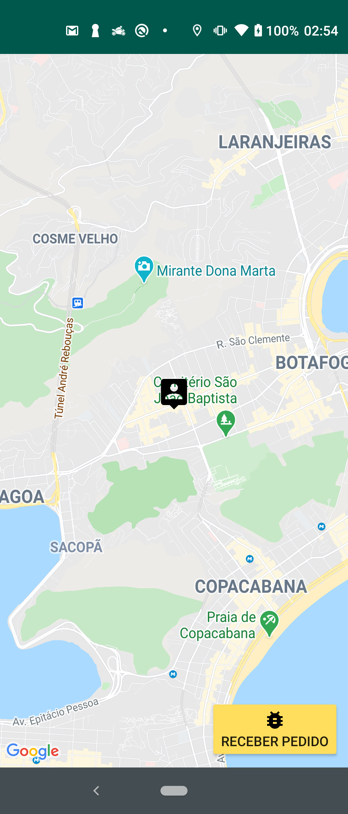
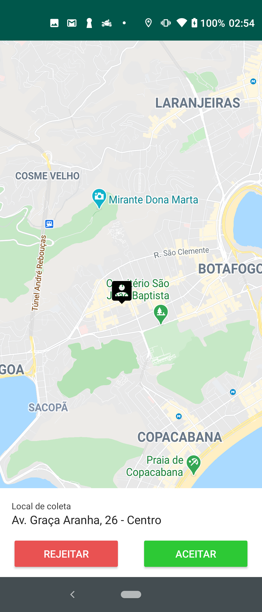
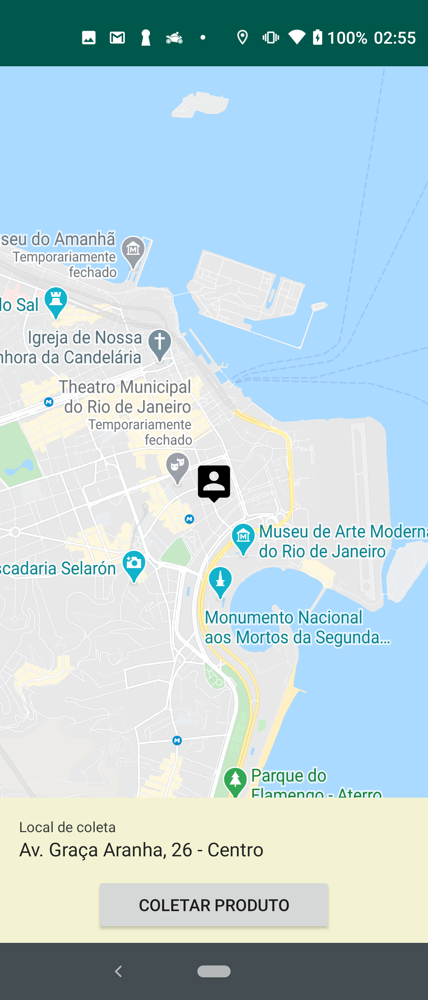
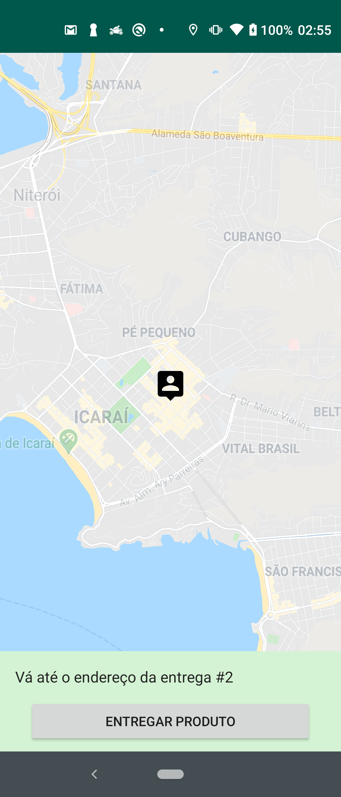
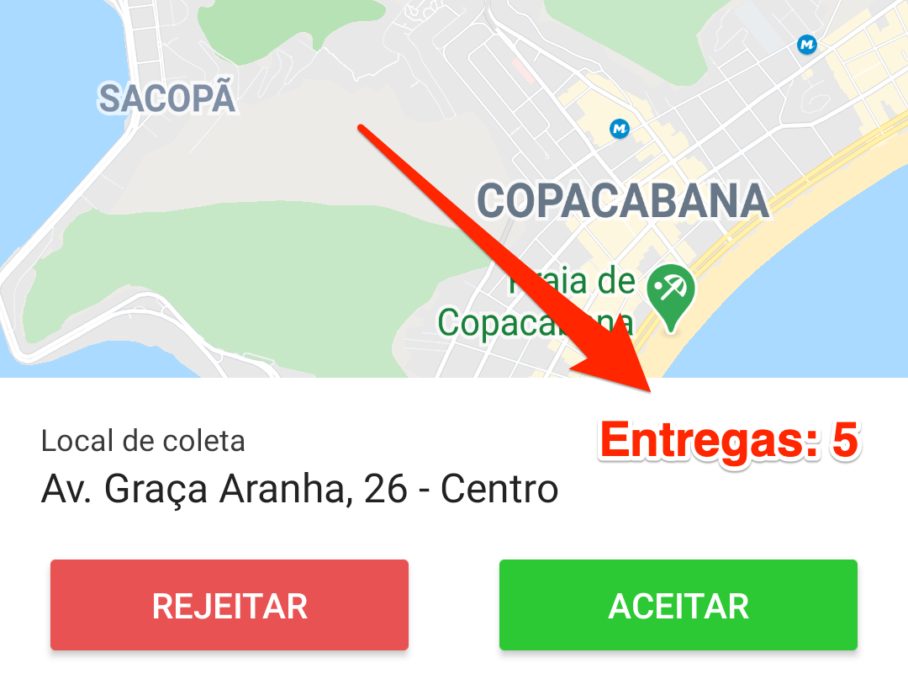
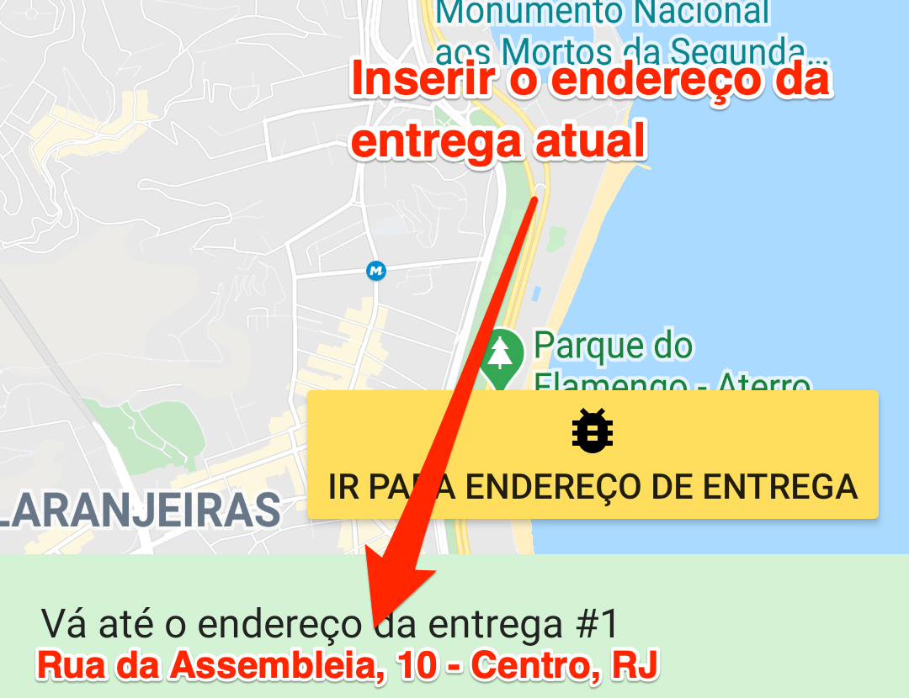
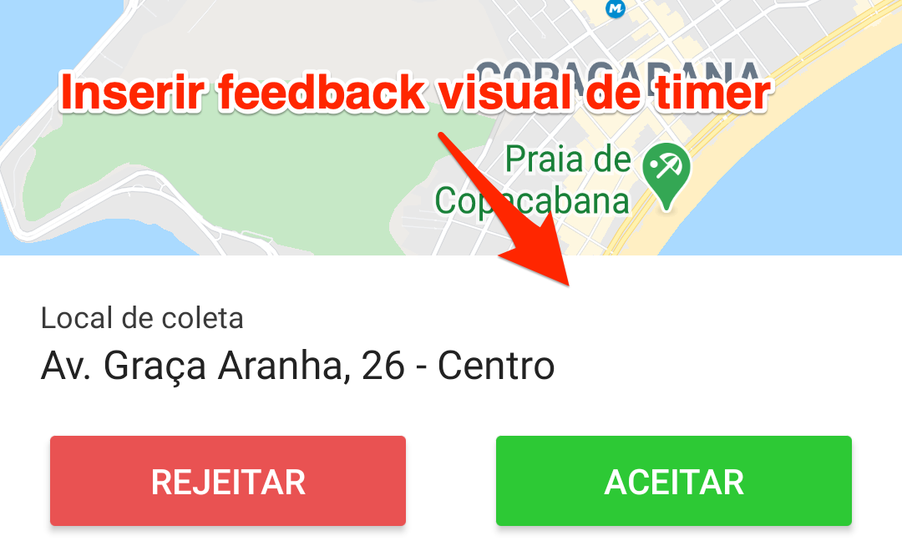

# Processo seletivo: Gaudium - Desenvolvedor Android
Bem vindo ao processo seletivo da Gaudium!

### Pré-requisitos
- Android Studio 3.5 ou superior
- Ter uma conta no GitHub
- Ter uma cópia deste repositório a partir do botão "Use this template" e convidar o usuário gaudiumtecnicos@gmail.com ao repositório criado
- Git instalado para fazer os commits do código no repositório próprio ao longo da prova
    - Caso tenha dificuldades, recomendamos usar o GitHub Desktop
- Internet estável 

## O desafio
Um empresário interessado em atuar no ramo de delivery quer lançar seu próprio app no mercado e dominar as entregas de sua região. Seu aplicativo já existe, mas está incompleto. Ele contratou uma empresa que cobrou barato e prometeu muito, e o resultado foi que eles sumiram sem dar satisfação e deixaram algumas coisas incompletas.

Para resolver seu problema, e não passar pelo mesmo sufoco duas vezes, ele escolheu uma grande empresa de desenvolvimento de software, Gaudium, para lhe ajudar a realizar o seu sonho de ter um aplicativo tão bom quanto o da concorrência. Assim, ele fica tranquilo em relação à qualidade enquanto pode se dedicar na sua marca.
Entretanto, devido ao golpe que levou, ele contratou apenas 3 horas de desenvolvimento, pois acredita que é suficiente para resolver seus piores problemas.

A implementação das melhorias foi dividida em duas etapas, cada uma com seu próprio grau de importância. Seu desafio será de fazer uma boa gestão de tempo para agregar o máximo de valor, com qualidade, ao produto final dentro do tempo contratado.

## Introdução

### O código atual
O código segue o modelo MVP padrão do Android e possui apenas uma tela, a MapsActivity. Essa tela se adapta de acordo com uma máquina de estados, exibindo em um menu inferior os dados e as ações relevantes para cada estado.
O estado atual do entregador fica armazenado na classe EntregadorObj e utiliza os Enums contidos no arquivo StatusEntregadorEnum para controlar o comportamento do app, sendo eles:

#### Disponível
É o estado inicial do aplicativo. Ele representa o usuário (entregador) que está disponível para receber novas ofertas de entrega.




#### Decidindo
Nesta etapa, o entregador visualiza uma oferta de entrega disponível que chegou até ele. Caso ele queira realizar a entrega, deve apertar o botão *Aceitar*. Caso não queira, *Rejeitar*.
Ao aceitar uma oferta, ele vai para o estado Colentado. Caso rejeite, volta para o estado disponível.



#### Coletando
A etapa de coleta representa o momento que o entregador está se locomovendo para o endereço de coleta, seja ele um mercado, estabelecimento, armazém, etc. O aplicativo exibe o endereço que o entregador deve se direcionar e, quando estiver próximo do endereço exibido, aparece também um botão de Coletar.
Ao apertar o botão Coletar, o entregador está confirmando que coletou o item a ser entregue e agora avança para o estado Entregando.



#### Entregando
Enquanto está entregando o entregador visualiza apenas o endereço que deve ser entregue no momento. A tela indica qual o pedido ele deve entregar no momento e, quando próximo do endereço, exibe um botão para confirmar a entrega e avançar. Caso o pedido tenha mais de um endereço de entrega, o entregador passará a ver o próximo endereço que deve realizar a entrega. Ao confirmar o último endereço, o app emitirá um som diferente informando que o pedido foi finalizado e voltará para o estado Disponível.




### Botão de debug

Para auxiliar no desenvolvimento, foi inserido um botão que realiza as ações necessárias para avançar em cada estado.
- No estado **DISPONÍVEL** o botão fará com que uma oferta de pedido chegue até o aparelho, como se alguém realmente estivesse solicitando.
- No estado **COLETANDO**, o botão irá transportar a localização do entregador para perto do endereço de coleta, para que este consiga avançar para o próximo estado.
- No estado **ENTREGANDO**, o botão irá transportar a localização do entregador para perto do endereço de entrega da vez, para que este consiga avançar para o próximo endereço ou finalizar as entregas.

## O desafio
### Instruções
Você deverá clonar o repositório atual e enviar para um repositório próprio.
Além disso, deverá convidar o usuário gaudiumtecnicos@gmail.com para o seu repositório com o código da prova.
Ao final de cada etapa concluída você deverá fazer um commit da alteração e, na descrição, explicar o que foi feito e qual foi a motivação para as decisões tomadas. Ao finalizar o commit, não esqueça de fazer o push.

### Etapa zero
Alterar o marcador do passageiro para um onde o fundo é branco. O marcador atual é o `pin_user.xml`, que possui um fundo transparente. A primeira tarefa será trocar o `pin_user.xml` pelo `pin_user_white.xml`, que é melhor de visualizar no mapa.
Ao finalizar essa etapa inicial, vamos fazer um commit deixando claro qual etapa resolvemos e, na descrição, explicar como chegou na solução enviada.
Ex: 

> **Summary:** Etapa zero: Mudança de imagem utilizada no pin do usuário

> **Description:** Como foi solicitado pelo cliente a troca da imagem de nome específico, procurei pelo código qualquer referência à essa imagem, "pin_user", e alterei onde foi encontrado conforme o solicitado.

### 1ª etapa
A primeira etapa possui a parte mais importante a ser implementada, que é a comunicação com o servidor da aplicação.
O app foi entregue sem uma biblioteca de comunicação web funcional, e o único serviço que está sendo utilizado (OfertaPedidoWebService) retorna uma estrutura fixa de pedido ao invés de carregar dados do servidor e adaptar a essa estrutura. 
O primeiro desafio é fazer com que o app obtenha os dados através das APIs, ao invés das estruturas *hard-coded*.

#### Detalhes da atividade
A api que deve ser chamada é a `/ps/ofertaPedido` e já se encontra declarada na variável `URL`, no arquivo `OfertaPedidoWebService.java`. Nesta classe existe um comentário que simula a chamada ao serviço. Para funcionar, será necessário replicar essa lógica em uma biblioteca de comunicação qualquer de sua escolha, mantendo as melhores práticas para a implementação de uma chamada a um serviço web, e retornar o objeto obtido como faz o comentário.
A api retorna uma resposta no formato JSON onde respeita a seguinte estrutura, onde a api retorna:
- `endereco_coleta`, que exibe o endereço  do local de coleta já formatado
- `lat_coleta`, com a latitude do local de coleta
- `lng_coleta`, com a longitude do local de coleta
- `entrega`, que é um array de entregas (sem limite de elementos)

Cada objeto no array de entrega contém:
- `endereco`, que exibe o endereço do local da entrega já formatado
- `lat`, com a latitude do local da entrega
- `lng`, com a longitude do local da entrega

url: http://3.95.2.52/ps/ofertaPedido.php
```json
{
    "success":"<String contendo "true" ou "false">",
    "response":{
        "endereco_coleta":"<String contendo o endereço de coleta>",
        "lat_coleta":"<double com a latitude do endereço de coleta>",
        "lng_coleta":"<double com a longitude do endereço de coleta>",
        "entrega":[
            {
                "lat":"<double com a latitude do endereço para entrega>",
                "lng":"<double com a latitude do endereço para entrega>",
                "endereco":"<String contendo o endereço para entrega>"
            },
            ...
        ]
   }
}   
```

### 2ª etapa
Agora que a conexão à internet já está funcionando, o cliente deseja inserir novas funcionalidades para bombar o seu app.
As atividades dessa etapa são as mais interessantes para o cliente, mas caso encontre dificuldade pode pular alguns detalhes e avançar para as demais.
Segue abaixo a lista de demandas do cliente:

#### 2.1 Inserir mais dados na tela e os pontos no mapa
1) Exibir a quantidade de entregas na tela de Oferta



2) Exibir no mapa o ponto de coleta e os pontos de entrega do pedido recebido conforme as regras abaixo:
    - No estado **DECIDINDO**, exibir no mapa o endereço de coleta e todos os endereços de entrega do pedido que está sendo ofertado no momento.
    - No estado **COLETANDO**, exibir no mapa o endereço de coleta e esconder os demais marcadores.
    - No estado **ENTREGANDO**, exibir no mapa o endereço de entrega atual e esconder os demais marcadores.

Ao desenhar os marcadores, devemos também ajustar o zoom do mapa para que os marcadores inseridos fiquem visíveis na tela. 
O endereço de coleta deve ser desenhado utilizando o drawable `pin_loja` e os endereços de entrega devem usar o `pin_entrega`.
    
**Atenção:** O marcador que representa a localização do entregador deve permanecer visível em todos os estados!

3) Na etapa **ENTREGANDO**, exibir o endereço da entrega atual abaixo da mensagem *"Vá até o endereço do pedido"*

**Dica:** O endereço da entrega não está na estrutura *hard-coded*, mas também é retornado pela API chamada. Faça ajustes para poder utiliza-lo nesta tarefa.



#### 2.2 Nova tela para mostrar os dados do entregador e o histórico
1) Criar uma tela de Perfil mostrando uma foto e o nome do entregador
    - A foto será fixa e já está presente no projeto com o nome de `profile_motoboy.png`
    - Os demai dados devem ser obtidos ao consumir a API `/ps/perfil`
2) Inserir em algum lugar da tela principal do app uma forma de acessar essa nova tela de perfil
3) Mais abaixo nessa mesma tela, exibir um saldo que deverá calculado a partir do somatório de todos os valores recebidos através do campo `historico`, na resposta do serviço, e formatado para a forma de visualização correta, em reais.
4) Abaixo do saldo deverá exibir todos os registros do campo `histórico` recebido pela API, exibindo em cada linha da lista a data da entrega e o valor recebido.

**Atenção:** Não se preocupe muito com o design da tela, a prioridade é que ela exiba corretamente, nas melhores práticas, o que foi solicitado.

A API `/ps/perfil` retorna os seguintes dados:
- `success`, indicando se funcionou ou não
- `response`, com os dados solicitados
- `nome`, com o nome do entregador
- `historico`, que é um array de histórico (sem limite de elementos)
Cada elemento no array de histórico possui os seguintes atributos
- `quando`, com a data já formatada para exibição
- `valor`, em float ainda não formatado para exibição.

Segue a estrutura:
url: http://3.95.2.52/ps/perfil.php
```json
{
    "success":"<String contendo "true" ou "false">",
    "response":{
        "nome":"<String com nome do entregador>",
        "historico":[
            {
                "quando":"<String com a data já pronta para visualização>",
                "valor":"<Float com o valor ganho pela entrega>"
             },
             {
                "quando":"<String com a data já pronta para visualização>",
                "valor":"<Float com o valor ganho pela entrega>"
            },
            ...
        ]
    }
}
```

### 3ª etapa
As tarefas dessa etapa são legais, mas talvez não seja possível entregar todas. Algumas agregam mais valor que outras, então faça o que for possível dando prioridade para as mais interessantes.

#### 3.1 Ofertas não podem durar para sempre
- No menu com as opções de Rejeitar ou Aceitar, que é exibido no estado *Decidindo* do objeto entregador, inserir um timer de 20 segundos com feedback visual para a oferta sumir, sendo visível para o entregador acompanhar o tempo restante. Após esse tempo, voltar o entregador para o estado *Disponível*.


#### 3.2 Utilizar a foto retornada pela API na tela de perfil do entregador
- Ao invés de sempre carregar a foto padrão, consumir a url da foto que é enviada pela api `/ps/perfil`, no campo `foto`.

#### 3.3 Exibir estabelecimentos parceiros na região
- Enquanto estiver no estado **DISPONÍVEL**, o app deverá exibir uma lista de estabelecimentos para que o entregador saiba de onde poderá chegar novos pedidos.
Para obter a localização dos estabelecimentos, o app deverá consumir de uma api `/ps/estabelecimentos` e, para cada local obtido, inserir um marcador no mapa utilizando a imagem `pin-loja`.

A API `/ps/estabelecimentos` possui um campo que conté, um array que contém apenas lat/lng de cada estabelecimento a ser desenhado no mapa, conforme vemos na estrutura abaixo.
A resposta possui os seguintes dados:
- `success`, indicando se funcionou ou não
- `response`, com os dados solicitados
- `estabelecimentos`, que é um array sem limite de elementos

Cada elemento no array `estabelecimentos` possui os seguintes dados
- `lat`, com a latitude do estabelecimento
- `lng`, com a longitude do estabelecimento

url: http://3.95.2.52/ps/estabelecimentos.php
```json
{
    "success":"<String contendo "true" ou "false">",
    "response":{
        "estabelecimentos":[
            {
                "lat":"<Double com a latitude do local do estabelecimento>",
                "lng":"<Double com a longitude do local do estabelecimento>"
             },
             {
                "lat":"<Double com a latitude do local do estabelecimento>",
                "lng":"<Double com a longitude do local do estabelecimento>"
             },
            ...
        ]
    }
}
```

### Conclusões
Enfim, boa sorte e boa prova! :)
